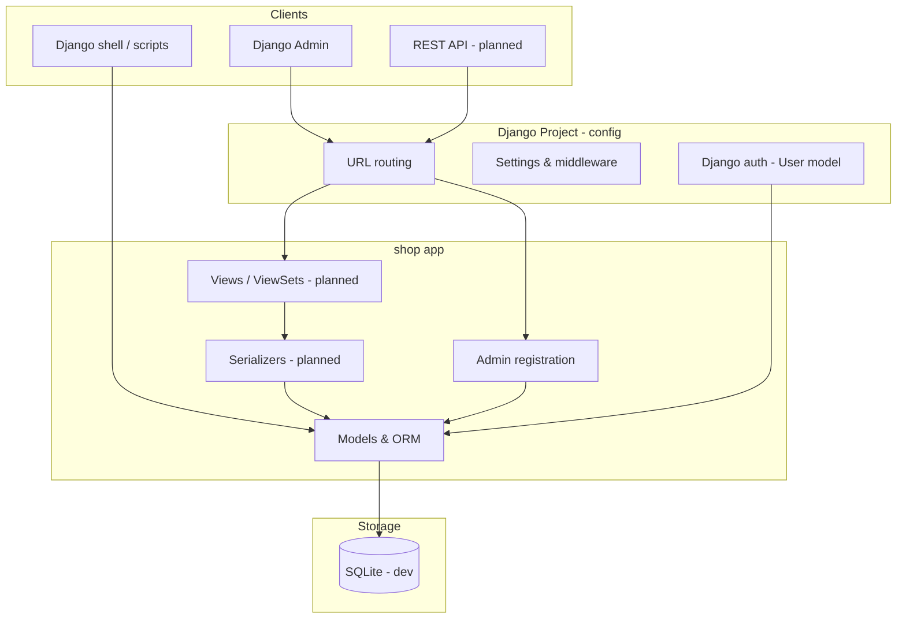
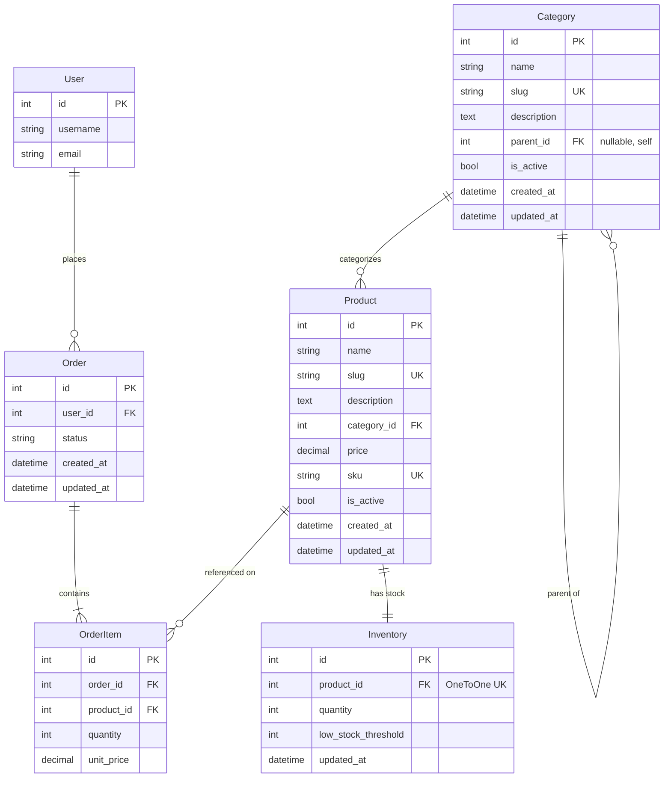
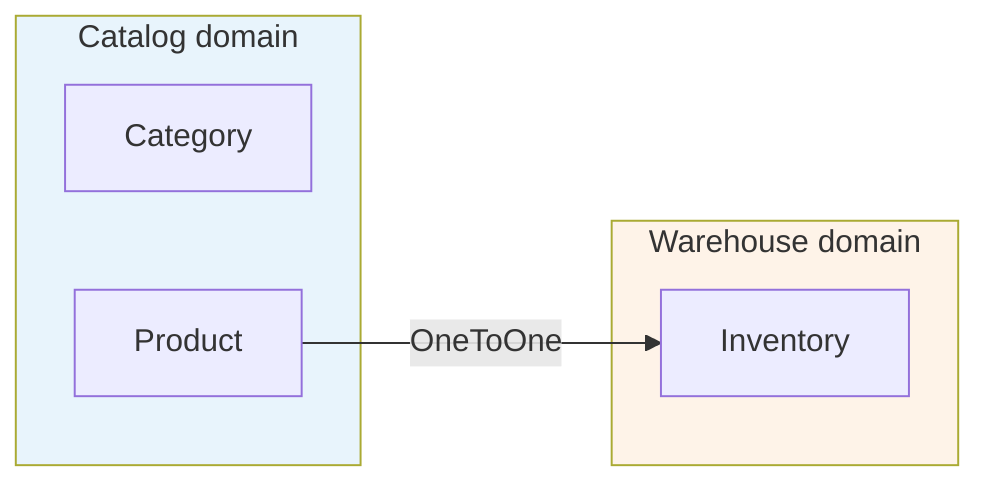
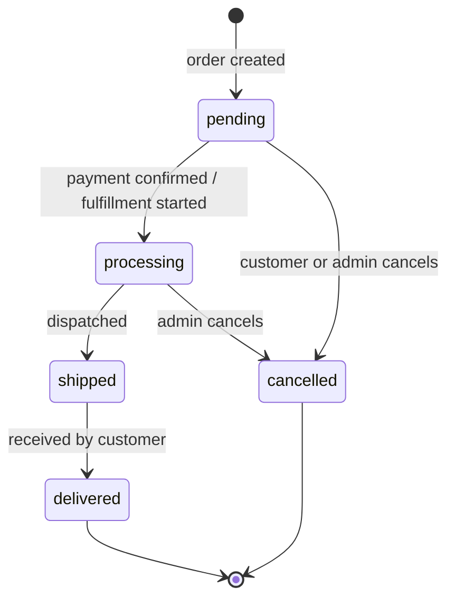
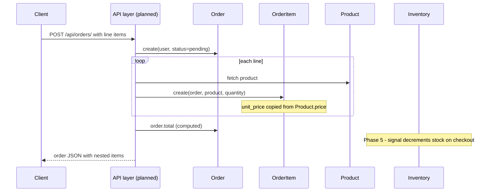

# Django E-Commerce Lite — Design Document

**Version:** 0.1.0  
**Status:** Models, admin, and initial migration applied; API pending  
**Purpose:** A learning-oriented e-commerce backend for exploring Django models, ORM, admin, serializers, views, and related patterns.

---

## 1. Goals and scope

### Goals

- Provide a realistic but small domain (online store) that exercises relational modeling in Django.
- Separate **catalog** (what we sell), **inventory** (how many we have), and **orders** (what customers bought).
- Support future work on DRF serializers, viewsets, permissions, signals, and ORM query patterns.
- Keep the codebase in a **single app** (`shop`) until complexity justifies splitting.

### In scope (current + planned)

| Area | Status |
|------|--------|
| Data models | Implemented |
| Django Admin | Implemented |
| Database migrations | Applied (`shop/migrations/0001_initial.py`) |
| REST API (DRF) | Planned |
| Auth for API | Planned |
| Inventory signals on checkout | Planned |
| Seed data / fixtures | Planned |

### Out of scope (for now)

- Payment processing (Stripe, etc.)
- Shipping addresses and tax calculation
- Product images and full-text search
- Multi-vendor / marketplace features
- Production deployment hardening

---

## 2. Architecture overview

The project follows a standard Django layout: one project package (`config`) and one domain app (`shop`). Django REST Framework and supporting libraries are installed and configured for upcoming API work.



### Project structure

```
django-ecommerce-lite/
├── config/              # Project settings, root URLs, WSGI/ASGI
├── shop/                # E-commerce domain (models, admin, future API)
│   ├── models.py
│   ├── admin.py
│   └── migrations/      # Single 0001_initial.py planned
├── docs/
│   └── DESIGN.md        # This document
├── manage.py
└── requirements.txt
```

---

## 3. Domain model

### 3.1 Entity-relationship diagram



### 3.2 Model responsibilities

| Model | Role | Analogy |
|-------|------|---------|
| **Category** | Hierarchical grouping for browse/filter | Aisle in a store |
| **Product** | Sellable catalog item with current list price | Item on the shelf |
| **Inventory** | Stock count separate from catalog | Back-room stock ledger |
| **Order** | Order header: who, when, fulfillment status | Receipt header |
| **OrderItem** | One line on an order | A line on the receipt |

---

## 4. Key design decisions

### 4.1 Summary table

| Decision | Choice | Alternatives considered | Justification |
|----------|--------|-------------------------|---------------|
| App structure | Single `shop` app | Split into `catalog`, `orders`, `inventory` | Simpler for learning; fewer cross-app imports; split later if needed |
| Order lines | Separate `OrderItem` model | Single `product` FK on `Order` | Orders can contain many products, each with its own quantity and price |
| Order total | Computed property (`Order.total`) | Stored `total` column on `Order` | Avoids drift when lines change; single source of truth |
| Line price | `unit_price` snapshot on `OrderItem` | Always read `Product.price` | Historical orders must stay correct after catalog price changes |
| Stock storage | `Inventory` OneToOne with `Product` | `quantity` field on `Product` | Separates merchandising from warehouse concerns; enables different update paths |
| Category tree | Self-referential `parent` FK | Flat categories only, or MPTT library | Supports subcategories without extra dependencies |
| Money fields | `DecimalField` | `FloatField` | Exact decimal arithmetic; industry standard for currency |
| User reference | `settings.AUTH_USER_MODEL` | Direct `User` import | Django best practice; supports custom user models later |
| Slugs | Auto-generated in `save()` if empty | Manual entry only | Convenient in admin; still overridable |
| Soft visibility | `is_active` on catalog models | Hard delete | Hide from storefront without losing referential history |
| Duplicate lines | `UniqueConstraint(order, product)` | Allow duplicate rows | One row per product per order; quantity holds count |
| Migrations | One initial migration for all models | Per-model migrations during development | Cleaner history for a greenfield learning project |
| Database (dev) | SQLite | PostgreSQL | Zero setup for local learning |
| API stack | DRF + django-filter + drf-spectacular | Plain Django views, Ninja | DRF is the most common choice; filter and OpenAPI support planned features |

### 4.2 Order header vs line items

An order is modeled as a **header + lines** pattern (common in e-commerce, ERP, and invoicing):

```
Order #42 (header)          OrderItem (lines)
──────────────────          ─────────────────────────────
user: alice                 1× Mouse    @ $29.99
status: processing          2× Keyboard @ $79.99
created_at: ...             ─────────────────────────────
total: computed → $189.97   sum(quantity × unit_price)
```

A single `ForeignKey` from `Order` to `Product` would only support **one product per order** and could not store per-line quantity or price snapshots.

### 4.3 `on_delete` behavior

| Relationship | `on_delete` | Rationale |
|--------------|-------------|-----------|
| `Category.parent` → `Category` | `CASCADE` | Deleting a parent removes orphan subcategories (acceptable for admin-managed taxonomy) |
| `Product.category` → `Category` | `PROTECT` | Cannot delete a category that still has products |
| `Inventory.product` → `Product` | `CASCADE` | Stock row has no meaning without its product |
| `Order.user` → `User` | `CASCADE` | Removing a user removes their orders (dev default; production may use `SET_NULL` or soft-delete users) |
| `OrderItem.order` → `Order` | `CASCADE` | Lines are owned by the order |
| `OrderItem.product` → `Product` | `PROTECT` | Products referenced on past orders must not be deleted |

### 4.4 Computed vs stored fields

| Field | Stored? | Notes |
|-------|---------|-------|
| `Order.total` | No | Sum of `OrderItem.line_total` |
| `OrderItem.line_total` | No | `quantity × unit_price` |
| `Inventory.is_low_stock` | No | `quantity <= low_stock_threshold` |
| `OrderItem.unit_price` | Yes | Snapshot; defaults from `Product.price` on save if unset |

**Rule of thumb:** Store facts at a point in time (`unit_price`); compute aggregates from related rows (`total`, `line_total`).

### 4.5 Catalog vs inventory separation



**Why separate?**

- Marketing can update name, description, and price without touching stock logic.
- Stock updates (sales, restocks) do not require editing the product record.
- Future signals or services can decrement inventory without coupling to catalog serializers.

---

## 5. Order lifecycle

### 5.1 Status flow



Statuses are defined as `Order.Status` (`TextChoices`) for validation and readable labels via `get_status_display()`.

### 5.2 Creating an order (intended flow)



---

## 6. Django Admin design

Admin is the primary UI until the REST API is built.

| Model | Admin features | Rationale |
|-------|----------------|-----------|
| **Category** | `prepopulated_fields` for slug; filter by parent | Fast data entry for hierarchical categories |
| **Product** | `InventoryInline` (StackedInline); category autocomplete | Edit stock on the same page as product (natural for OneToOne) |
| **Inventory** | Low-stock boolean column; product autocomplete | Warehouse-focused list view |
| **Order** | `OrderItemInline` (TabularInline); computed total | Edit header and lines together |
| **OrderItem** | Standalone admin with line total display | Debug and inspect individual lines |

---

## 7. Technology stack

| Layer | Choice | Version (pinned in requirements.txt) |
|-------|--------|--------------------------------------|
| Language | Python | 3.13 |
| Framework | Django | 6.0.x |
| API | Django REST Framework | 3.17.x |
| Filtering | django-filter | 25.x |
| API docs | drf-spectacular | 0.29.x |
| Database (dev) | SQLite | built-in |
| Auth | Django built-in `User` | via `AUTH_USER_MODEL` |

### DRF configuration (already in settings)

- `DEFAULT_SCHEMA_CLASS` → OpenAPI schema generation
- `DEFAULT_FILTER_BACKENDS` → query-string filtering on list endpoints (when implemented)

---

## 8. Planned API surface

Not implemented yet; included here so model design aligns with upcoming endpoints.

| Method | Endpoint | Description |
|--------|----------|-------------|
| GET | `/api/products/` | List products (filter by category, price, active) |
| GET | `/api/products/{slug}/` | Product detail with inventory |
| GET | `/api/categories/` | List categories |
| GET | `/api/categories/{slug}/products/` | Products in a category |
| GET/POST | `/api/orders/` | List/create orders (auth required for write) |
| GET | `/api/orders/{id}/` | Order detail with nested items |
| POST | `/api/orders/{id}/checkout/` | Custom action (planned) |
| GET | `/api/schema/swagger-ui/` | Interactive API docs |

---

## 9. Learning roadmap (phases)

| Phase | Topic | Tied to this design |
|-------|-------|---------------------|
| 1 | Models & migrations | ER diagram above; single `0001_initial` migration |
| 2 | ORM queries | `select_related`, `prefetch_related`, aggregations on orders/products |
| 3 | Serializers | Nested `OrderItem` in `OrderSerializer`; read/write split |
| 4 | Views & viewsets | Product list filters; order create with nested items |
| 5 | Permissions & signals | Order owner permissions; inventory decrement on order |
| 6 | Advanced | Custom managers, `atomic()` checkout, caching, tests |

---

## 10. Open questions / future revisions

These are intentionally deferred:

1. **User deletion policy** — `CASCADE` on orders is fine for dev; production may need soft-delete or anonymization.
2. **Tags on products** — M2M `Tag` model for faceted search (not yet modeled).
3. **Order-level shipping/billing** — separate models or JSON; add when requirements clarify.
4. **Inventory history** — current design stores only current quantity, not an audit log.
5. **Splitting apps** — consider `catalog` vs `orders` if the codebase grows beyond learning scope.

---

## 11. References in codebase

| Artifact | Location |
|----------|----------|
| Models | `shop/models.py` |
| Admin | `shop/admin.py` |
| Settings | `config/settings.py` |
| Root URLs | `config/urls.py` |

---

*Document last updated to reflect the model and admin layer as implemented. Update this file when migrations, API endpoints, or major design choices change.*
