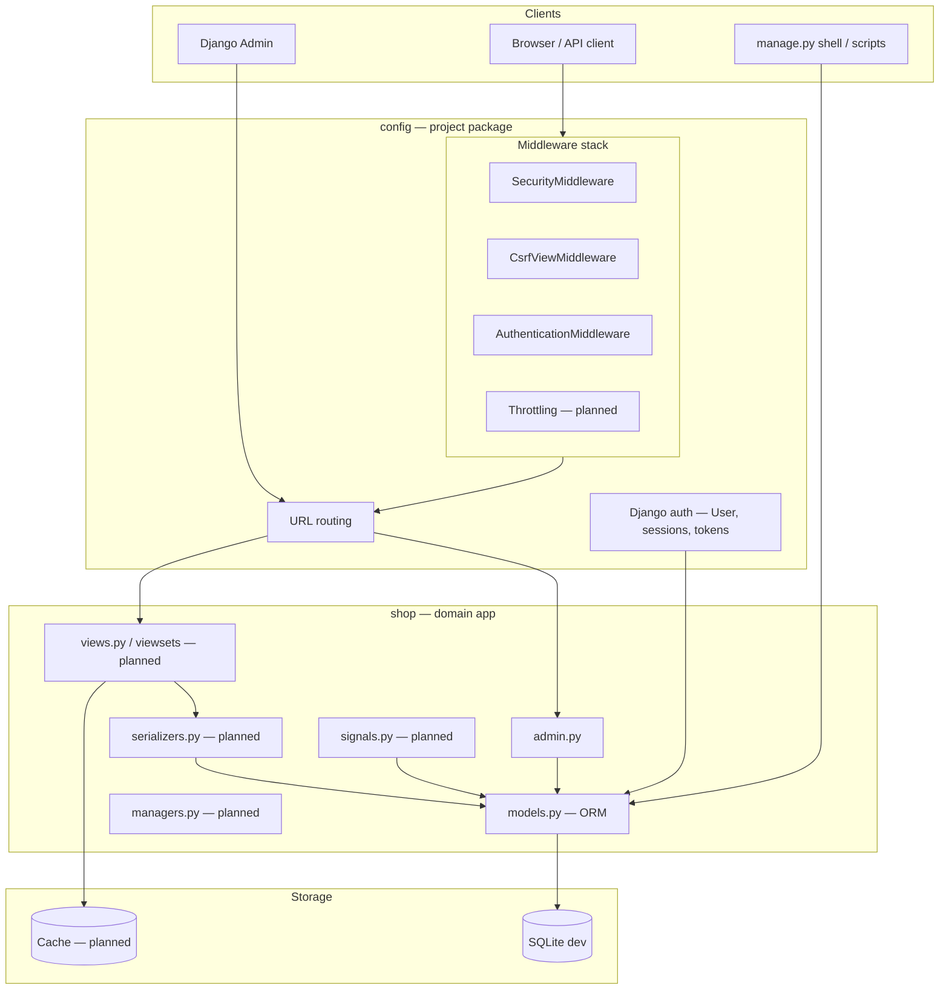
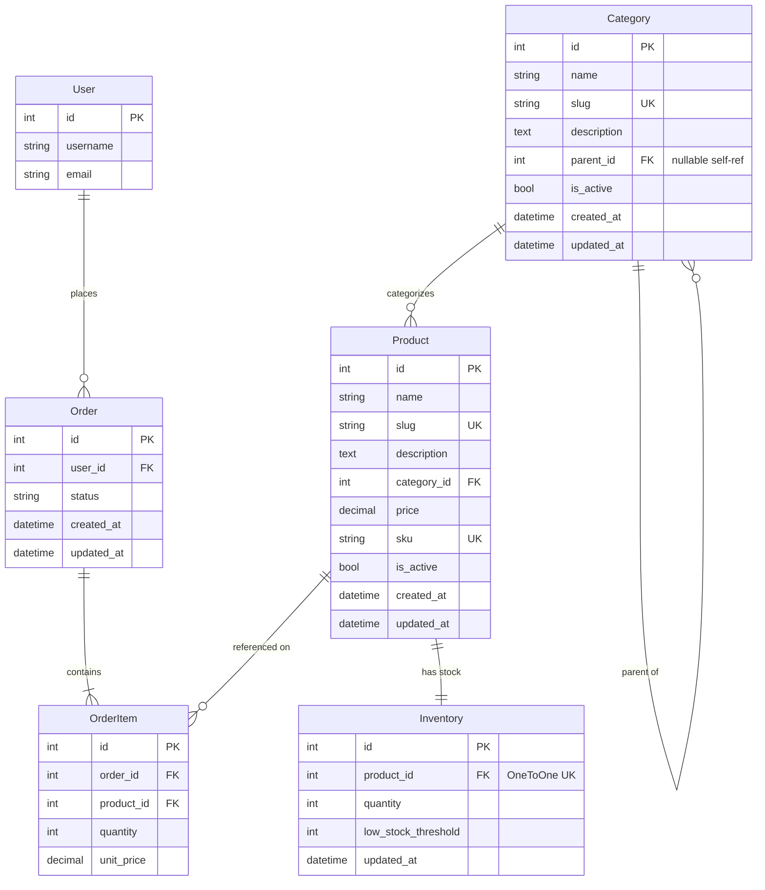
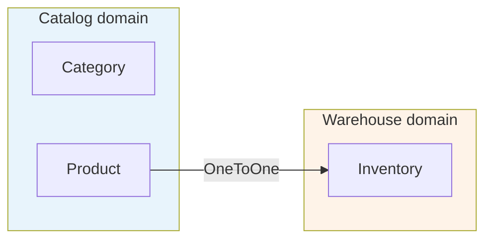
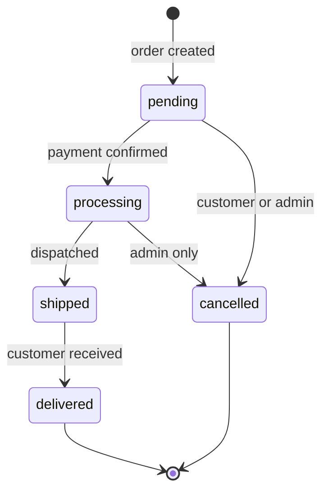
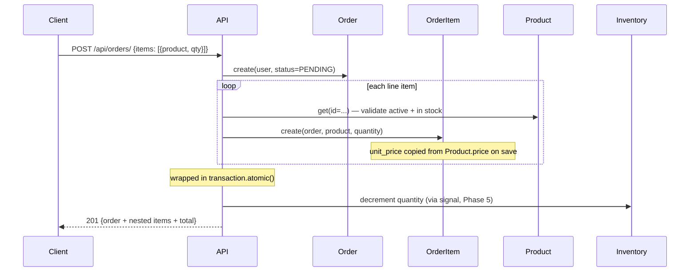

# Django E-Commerce Lite — Design Document

**Version:** 0.2.0
**Status:** Models, admin, and `0001_initial` migration applied; API pending
**Purpose:** A learning-oriented e-commerce backend. The domain (online store) is realistic enough to exercise advanced Django patterns without becoming a full product.

---

## 1. Goals and scope

### Learning goals

This project exists to build hands-on fluency with the following Django topics, roughly in the order they appear in the roadmap:

| Topic | What you'll practise |
|-------|----------------------|
| **Models & ORM** | Relational design, `select_related`, `prefetch_related`, annotations, aggregations, `Q` objects, `F` expressions, custom managers |
| **Serializers** | `ModelSerializer`, nested writes, field validation, read/write split |
| **Views & viewsets** | `APIView`, generic views, `ViewSet`, `Router`, custom `@action` |
| **Authentication & security** | Session vs token auth, `IsAuthenticated`, object-level permissions, CSRF, throttling |
| **Signals** | `post_save` / `pre_delete` handlers, connecting via `AppConfig.ready()` |
| **Transactions** | `atomic()` for checkout integrity |
| **Caching** | `cache_page`, low-level cache API, cache invalidation patterns |
| **Testing** | `APITestCase`, fixtures, `factory_boy`, coverage |
| **Python practices** | Type hints, `dataclasses`, `Enum` / `TextChoices`, properties vs methods |
| **Performance** | Query count analysis with `django-debug-toolbar`, N+1 identification |

### In scope

| Area | Status |
|------|--------|
| Data models | Done |
| Django Admin | Done |
| Initial migration | Applied (`shop/migrations/0001_initial.py`) |
| Seed data / fixtures | Planned |
| REST API (DRF) | Planned |
| Authentication for API | Planned |
| Permissions (object-level) | Planned |
| Inventory signals on checkout | Planned |
| Caching layer | Planned |
| Test suite | Planned |
| OpenAPI docs (drf-spectacular) | Planned |

### Out of scope (intentionally deferred)

- Payment processing (Stripe, etc.)
- Shipping addresses and tax calculation
- Product images and media storage
- Full-text search
- Multi-vendor / marketplace features
- Production deployment configuration

---

## 2. Architecture overview



### Project structure

```
django-ecommerce-lite/
├── config/
│   ├── settings.py        # Project settings
│   ├── urls.py            # Root URL conf
│   ├── wsgi.py
│   └── asgi.py
├── shop/
│   ├── migrations/
│   │   └── 0001_initial.py
│   ├── models.py          # All domain models
│   ├── admin.py           # Admin registration
│   ├── apps.py            # AppConfig (ready() for signals, planned)
│   ├── views.py           # Placeholder — viewsets planned
│   ├── tests.py           # Placeholder — test suite planned
│   ├── serializers.py     # Planned
│   ├── signals.py         # Planned
│   └── managers.py        # Planned
├── docs/
│   └── DESIGN.md
├── manage.py
└── requirements.txt
```

---

## 3. Domain model

### 3.1 Entity-relationship diagram



### 3.2 Model responsibilities

| Model | Role | Analogy |
|-------|------|---------|
| `Category` | Hierarchical grouping for browse/filter | Aisle in a store |
| `Product` | Sellable item with current list price | Item on the shelf |
| `Inventory` | Current stock count, separate from catalog | Back-room stock ledger |
| `Order` | Purchase header: who, when, fulfillment status | Receipt header |
| `OrderItem` | One line on a receipt: what, how many, at what price | A line on the receipt |

---

## 4. Key design decisions

### 4.1 Summary table

| Decision | Choice made | Alternatives | Justification |
|----------|-------------|--------------|---------------|
| App structure | Single `shop` app | Split into `catalog`, `orders`, `inventory` | Simpler imports while learning; split later if needed |
| Order lines | Separate `OrderItem` model | Single `product` FK on `Order` | One order can contain many products, each with its own quantity and price |
| Order total | Computed property (`Order.total`) | Stored `total` column | Avoids data drift; single source of truth — but see N+1 warning below |
| Line price | `unit_price` snapshot on `OrderItem` | Always read `Product.price` | Historical orders must survive catalog price changes |
| Stock storage | `Inventory` OneToOne | `quantity` field on `Product` | Separates merchandising from warehouse; different write paths |
| Category tree | Self-referential `parent` FK | Flat list; MPTT library | Handles subcategories without an extra dependency; MPTT is better for deep trees |
| Money fields | `DecimalField` | `FloatField` | Exact decimal arithmetic; float is unsuitable for currency |
| User reference | `settings.AUTH_USER_MODEL` | Direct `User` import | Django best practice; survives swapping in a custom user model |
| Slug generation | Auto in `save()` if blank | Always require manual entry | Convenient in admin; explicit override still possible |
| Soft visibility | `is_active` flag | Hard delete | Preserves referential history; items can be hidden from the storefront |
| Duplicate line guard | `UniqueConstraint(order, product)` | Allow duplicate rows | One row per product; quantity carries the count |
| Migration strategy | One `0001_initial` for all models | Per-model migrations during dev | Cleaner history for a greenfield learning project |
| Database (dev) | SQLite | PostgreSQL | Zero-config for local learning; switch to Postgres for realistic query behaviour |
| API stack | DRF + django-filter + drf-spectacular | Plain Django views, FastAPI, Ninja | DRF is the industry standard; filter and OpenAPI docs support planned features |

### 4.2 Order header vs line items

```
Order #42 (header)          OrderItem (lines)
──────────────────          ─────────────────────────────
user: alice                 1× Mouse    @ $29.99
status: processing          2× Keyboard @ $79.99
created_at: ...             ─────────────────────────────
total: computed → $189.97   sum(quantity × unit_price)
```

A single `product` FK on `Order` supports only one product per order and provides nowhere to store per-line `quantity` or a price snapshot. `OrderItem` is the standard **header + lines** pattern used in e-commerce, ERP, and invoicing.

### 4.3 `on_delete` policy

| Relationship | `on_delete` | Why |
|---|---|---|
| `Category.parent` → `Category` | `CASCADE` | Deleting a parent removes orphan subcategories; acceptable for admin-managed taxonomy |
| `Product.category` → `Category` | `PROTECT` | Cannot delete a category that still has products |
| `Inventory.product` → `Product` | `CASCADE` | Stock row has no meaning without the product |
| `Order.user` → `User` | `CASCADE` | Dev default; production may prefer `SET_NULL` with anonymisation |
| `OrderItem.order` → `Order` | `CASCADE` | Line items are owned by the order |
| `OrderItem.product` → `Product` | `PROTECT` | Products referenced on past orders must not be deleted |

### 4.4 Computed vs stored fields

| Field | Stored? | Notes |
|-------|---------|-------|
| `OrderItem.unit_price` | Yes | Snapshot; copied from `Product.price` on first save |
| `OrderItem.line_total` | No | `quantity × unit_price` |
| `Order.total` | No | Sum of all `line_total` values |
| `Inventory.is_low_stock` | No | `quantity <= low_stock_threshold` |

**Rule of thumb:** Store facts that are true at a point in time (`unit_price`). Compute aggregates from related rows (`total`, `line_total`). Never store something that can go stale.

### 4.5 Catalog vs inventory separation



Keeping stock data out of the `Product` model means:

- Catalog edits (name, price, description) don't touch stock rows.
- Stock updates (sale, restock, signal) don't require saving the product.
- A future `post_save` signal on `OrderItem` can decrement inventory without touching any catalog code.

---

## 5. Known design weaknesses and ORM gotchas

These are **intentional teaching moments** — places where the current design is simple but will need improvement in a production system.

### 5.1 N+1 on `Order.total`

```python
@property
def total(self):
    return sum((item.line_total for item in self.items.all()), Decimal("0"))
```

This issues **one extra query per order** to fetch its items. If you list 50 orders in the admin, that is 51 queries. The ORM fix — `prefetch_related("items")` — will be practised in Phase 2.

**Learning exercise:** Use `django-debug-toolbar` to count queries on the Order admin list view. Then fix it with `prefetch_related` and an `annotate`-based total.

### 5.2 `save()` for slug generation is not bulk-safe

`Category.save()` and `Product.save()` auto-generate slugs, but Django's `QuerySet.bulk_create()` bypasses `save()`. Slugs will be empty for bulk-inserted rows. This is fine for admin-driven data entry; document it before adding any bulk import feature.

### 5.3 No slug uniqueness collision handling

If two categories share a name (e.g. "Sale" in two different tenants, or just a name reuse), `slugify` produces the same slug and the `unique=True` constraint raises an `IntegrityError`. A production system would append a counter (`sale-2`, `sale-3`). This is worth implementing as a Python practices exercise.

### 5.4 `unit_price` is nullable

`unit_price = models.DecimalField(..., null=True, blank=True)` means `line_total` can raise `TypeError` on unsaved items. This is safe only because `save()` always sets it before the row is persisted. Consider making it non-nullable with a sentinel validator in Phase 3.

### 5.5 Inventory is not created automatically with a Product

Creating a `Product` does not create its `Inventory` row. Code must do that explicitly, or a `post_save` signal on `Product` can handle it. This is the Phase 5 signal exercise.

---

## 6. Order lifecycle

### 6.1 Status transitions



Status values are defined as `Order.Status` (`TextChoices`) — an inner class on the model. This keeps the allowed values co-located with the model and provides `get_status_display()` for human-readable labels.

### 6.2 Order creation flow (planned)



The entire order creation block will be wrapped in `transaction.atomic()` so a failure on any line item rolls back the whole order. This is the Phase 6 transactions exercise.

---

## 7. Django Admin design

Admin is the primary data-entry UI until the REST API is built.

| Model | Inline / feature | Why |
|-------|-----------------|-----|
| `Category` | `prepopulated_fields` for slug | Slug auto-fills as you type the name |
| `Product` | `InventoryInline` (StackedInline), category autocomplete | Edit stock on the same screen; natural for OneToOne |
| `Inventory` | Boolean `is_low_stock` column | Warehouse-style overview, at-a-glance stock health |
| `Order` | `OrderItemInline` (TabularInline), computed total | Edit header and lines in one form |
| `OrderItem` | Standalone admin with `line_total` | Useful for debugging individual lines |

---

## 8. Technology stack

| Layer | Library | Version |
|-------|---------|---------|
| Language | Python | 3.13 |
| Framework | Django | 6.0.x |
| REST API | Django REST Framework | 3.17.x |
| Query filtering | django-filter | 25.x |
| API schema / docs | drf-spectacular | 0.29.x |
| Database (dev) | SQLite | built-in |
| Auth | Django built-in (`AUTH_USER_MODEL`) | — |

**DRF settings already applied in `config/settings.py`:**

- `DEFAULT_SCHEMA_CLASS` → `drf_spectacular.openapi.AutoSchema` (generates OpenAPI schema automatically)
- `DEFAULT_FILTER_BACKENDS` → `DjangoFilterBackend` (enables `?field=value` query params on list views)

**Libraries to add in later phases:**

| Phase | Library | Purpose |
|-------|---------|---------|
| 4 | `djangorestframework-simplejwt` | JWT authentication for the API |
| 6 | `django-debug-toolbar` | Query count analysis |
| 6 | `factory-boy` | Test data factories |

---

## 9. Planned API surface

| Method | Endpoint | Auth required | Notes |
|--------|----------|---------------|-------|
| `POST` | `/api/auth/token/` | No | Obtain JWT token |
| `POST` | `/api/auth/token/refresh/` | No | Refresh JWT token |
| `GET` | `/api/categories/` | No | List categories |
| `GET` | `/api/categories/{slug}/products/` | No | Products in a category |
| `GET` | `/api/products/` | No | List products; filter by `?category=`, `?min_price=`, `?max_price=` |
| `GET` | `/api/products/{slug}/` | No | Product detail with nested inventory |
| `GET` | `/api/orders/` | Yes | List own orders |
| `POST` | `/api/orders/` | Yes | Create order with nested items |
| `GET` | `/api/orders/{id}/` | Yes (owner) | Order detail with nested items and total |
| `PATCH` | `/api/orders/{id}/` | Yes (owner) | Update status (e.g. cancel) |
| `POST` | `/api/orders/{id}/checkout/` | Yes (owner) | Custom action: confirm + decrement inventory |
| `GET` | `/api/schema/` | No | OpenAPI JSON schema |
| `GET` | `/api/schema/swagger-ui/` | No | Interactive Swagger UI |

Object-level permission: only the order's owner can retrieve or modify it. Admins bypass this.

---

## 10. Learning roadmap

Work through these phases in order. Each phase produces runnable, tested code.

### Phase 1 — Models & migrations ✅

- Five models with full relationships
- Django Admin wired up with inlines and search
- Single `0001_initial` migration applied

**Key concepts covered:** field types, `on_delete`, OneToOne vs FK vs M2M, `Meta`, `TextChoices`, `save()` overrides, `@property`.

---

### Phase 2 — ORM deep dive

Use `manage.py shell` and the admin to run queries. Goal: understand _how_ Django translates Python to SQL.

Exercises to complete:

```python
# 1. select_related — one query instead of N+1 for FK traversal
Product.objects.select_related("category").all()

# 2. prefetch_related — one extra query for reverse FK / M2M
Order.objects.prefetch_related("items__product").all()

# 3. Aggregation — order totals without Python loops
from django.db.models import Sum, F
OrderItem.objects.values("order").annotate(total=Sum(F("quantity") * F("unit_price")))

# 4. Q objects — OR / NOT in filters
from django.db.models import Q
Product.objects.filter(Q(price__lt=50) | Q(category__name="Sale"))

# 5. F expressions — compare fields without loading objects into Python
from django.db.models import F
Inventory.objects.filter(quantity__lte=F("low_stock_threshold"))

# 6. Custom manager
class ActiveProductManager(models.Manager):
    def get_queryset(self):
        return super().get_queryset().filter(is_active=True)
```

Fix the `Order.total` N+1 (see §5.1) using `annotate`.

---

### Phase 3 — Serializers

Build `shop/serializers.py`. Concepts covered:

| Serializer | Concept |
|------------|---------|
| `CategorySerializer` | `ModelSerializer`, `SlugRelatedField` |
| `ProductListSerializer` | Read-only flat representation |
| `ProductDetailSerializer` | Nested `InventorySerializer` |
| `OrderItemSerializer` | Write-only `product` by id; `unit_price` read-only |
| `OrderReadSerializer` | Nested items; `SerializerMethodField` for `total` |
| `OrderWriteSerializer` | Nested create: one `POST` body creates `Order` + many `OrderItem` rows |

Key validation exercise: reject an `OrderItem` if `Inventory.quantity` would go negative.

---

### Phase 4 — Views & viewsets

Build `shop/views.py` and `shop/urls.py`. Progress from simple to composable:

1. `APIView` — manual `get()` / `post()`, understand request/response
2. `ListCreateAPIView` — products list
3. `RetrieveAPIView` — product detail by slug
4. `ModelViewSet` + `DefaultRouter` — full CRUD in ~10 lines
5. `@action(detail=True, methods=["post"])` — checkout endpoint

Wire up `django-filter` for `?category=`, `?min_price=`, `?max_price=` on the product list.

---

### Phase 5 — Authentication, permissions, and signals

**Authentication:**
- Add `djangorestframework-simplejwt`
- Protect write endpoints with `IsAuthenticated`

**Permissions:**
- Write a custom `IsOwnerOrAdmin` permission class
- Apply it to order detail and patch endpoints

**Signals** in `shop/signals.py`, connected in `ShopConfig.ready()`:
- `post_save` on `OrderItem` → decrement `Inventory.quantity`
- `post_save` on `Product` → auto-create `Inventory` row if missing

---

### Phase 6 — Transactions, caching, and optimisation

**Transactions:**
- Wrap order creation in `transaction.atomic()`
- Verify rollback on invalid line item

**Caching:**
- `@cache_page` on the product list view
- Low-level `cache.get` / `cache.set` for category tree
- Cache invalidation on `Product.save()`

**Optimisation:**
- Install `django-debug-toolbar`
- Count queries on order list view (before and after `prefetch_related`)
- Use `only()` / `defer()` to limit columns fetched

---

### Phase 7 — Testing

Write tests in `shop/tests/`:

| Test class | What it covers |
|------------|----------------|
| `CategoryModelTest` | `save()` slug generation, uniqueness |
| `InventoryPropertyTest` | `is_low_stock` edge cases |
| `OrderTotalTest` | `total` with multiple items |
| `ProductListAPITest` | Filter params, pagination |
| `OrderCreateAPITest` | Nested create, stock validation, `atomic()` rollback |
| `OrderPermissionTest` | Non-owner cannot retrieve or patch |

Use `factory_boy` for concise test data setup.

---

### Phase 8 — Python practices and code quality

Revisit the codebase with fresh eyes:

- Add type hints to all function signatures
- Extract service functions for complex business logic (e.g. checkout) out of views
- Review and tighten docstrings
- Add `default_auto_field = "django.db.models.BigAutoField"` to `ShopConfig`
- Consider `__all__` in `__init__.py` files
- Run `ruff` or `flake8` and `mypy` across the project

---

## 11. Open questions

Deferred by design — revisit when the roadmap reaches the relevant phase:

| # | Question | When to revisit |
|---|----------|-----------------|
| 1 | User deletion policy — `CASCADE` is right for dev; production needs anonymisation or `SET_NULL` | Before any production deployment |
| 2 | Tags on products — M2M `Tag` model for faceted filtering | Phase 2 (good M2M exercise) |
| 3 | Slug collision handling — append counter on duplicate names | Phase 8 (Python practices) |
| 4 | Inventory history / audit log — current design stores only current qty | Phase 6 (signals exercise) |
| 5 | Order-level shipping/billing address — separate model or `JSONField` | Phase 3 or 4 |
| 6 | Split into multiple apps — `catalog` / `orders` / `inventory` | When a single `models.py` becomes unwieldy |
| 7 | Switch to PostgreSQL for dev — needed for `JSONField`, full-text search, and realistic query plans | Phase 6 (optimisation) |

---

## 12. References

| Artifact | Location |
|----------|----------|
| Models | `shop/models.py` |
| Admin | `shop/admin.py` |
| App config | `shop/apps.py` |
| Project settings | `config/settings.py` |
| Root URLs | `config/urls.py` |
| This document | `docs/DESIGN.md` |

---

*Update this document when: a new phase is complete, a design decision changes, or a new known weakness is identified.*
